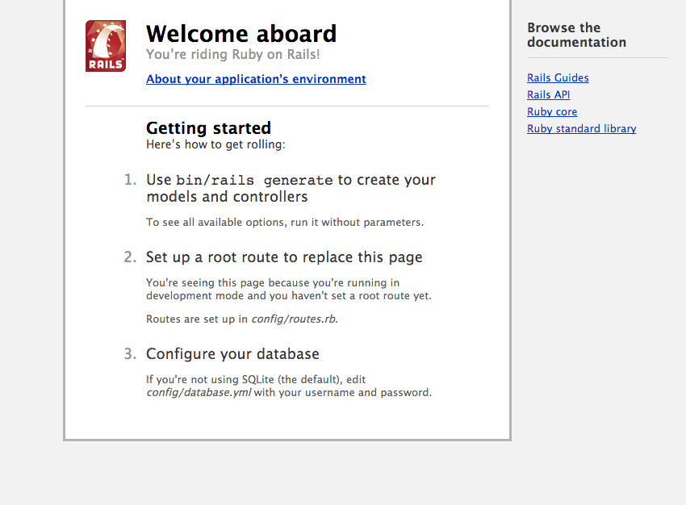

# Rails Walkthrough 


## Create the App

Now that you've familiarized yourself with MVC, let's build our first app!

**Challenge 1:** Create the application

- Go to [the Rails Guide](http://guides.rubyonrails.org/getting_started.html#creating-the-blog-application) (ie: your new best friend) and figure out how to create a new application
- name the application pizza_shop
- once complete cd into the app and run `bundle install`
- fire up your server and make sure you're seeing this:



- commit that up to github with the a message of "uploads initial files"

<br>
**Challenge 1 Answer:**

```shell 
$ rails new pizza_shop
$ cd pizza_shop
$ bundle install
$ rails server

$ git init
$ git add .
$ git commit -m "uploads initial files"

```


- - - -

## Walkthrough the file structure

Let's detour for a moment and take a walk through your the file-tree.

### The App Directory

The `app` directory is where you’ll spend most of your time.


#####`assets`

- The `assets` directory contains your “front-end” development files:
	- images, 
	- Javascript (.js , .js.coffee)
	- style sheets (.css , .css.scss aka “sass”)

The files within this directory use the Rails asset pipeline... which is a topic for another time....


#####`controllers`

- The controllers directory contains all of the controllers for our application.
- Application controller - is given by default.
	- this contains the core controller of the application.<br> 

*note: notice it is structured as a class. Usually, all of our other controllers are going INHERIT from the application controller.*

- Methods in the controller are also known as `actions`.
- The `ActionController` is the core of web requests and determines whether to `render` or `redirect`.
- `actions` by default render a template in the `app/views` directory corresponding to the name of the action 


#####`helpers`

contains view `helpers` for the application.

- As we generate different parts of our application  
	- assets
	- dates
	- forms
	- numbers 
	- model objects
	- etc. 
	 
- each particular piece of code that we generate will get its own helper. ( `_helper.rb` )
- used to generate code for our `views`.
- Rails encourages “creating custom helpers to extract complicated logic or reusable functionality.”


#####`mailers` 

Allows you to create mailer methods and views that correspond with your application. 


#####`models` 

contain all our different models and defines the table structure of our data

#####`views` 

contains the layout for our applicaiton

#####`bin` 

contains our application executables (or “command line executables”), as well as different programmatic functions that we'll use with Rails.

- Can be directly read by your computer, but not by humans. 
- The files we write need to be compiled in order to be read by computers.
- Ex: 
	- bundle 
	- rake 
	- rails 
	- gem

#####`config` 

contains different configurations for our application.

- `environments`: 
	- development (us!) 
	- production - for the user 
	- testing - for use with RSpec or MiniTest
- `routes`:
	- directs the requests in our application
	- also determines what to do with API requests
- `database.yml` 
	- contains our database configuration for each environment.<br>*Notice: sqlite3 (versus SQL, postresql…)*

#####`db`

- seeds - Use this file to create default data (ie: special admin user)
- database migrations - Ruby scripts that modify the tables in your database
- schema - shows the current state of your app’s database


#####`lib`

- Contains any reusable library code you might write
	- ie: any code that is not domain specific, that you may want to use for another project.

#####`log`

contains the server logs for our application 


#####`public` 

- contains some basic static pages
- favicon.ico - the little icon on your browser tab
- robots.txt - controls how search engines index your app

#####`test`

contains all of the specs for your test suite

#####`tmp`

stores temporary files

#####`vendor` 

- holds assets needed by 3rd party gems that you add to your app
- similar to the lib directory (but this is for using other people’s code)

##### `.gitignore`

files that will not be tracked with git

##### `gemfile`

where all the fun gems are stored


